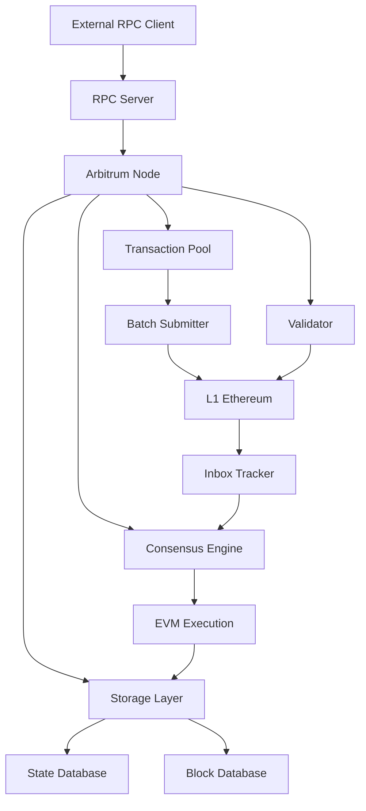

# Arbitrum-Reth Architecture Documentation

This document provides a comprehensive overview of the Arbitrum-Reth architecture, design decisions, and implementation strategy.

## Table of Contents

1. [Overview](#overview)
2. [Core Design Principles](#core-design-principles)
3. [System Architecture](#system-architecture)
4. [Component Details](#component-details)
5. [Reth SDK Integration](#reth-sdk-integration)
6. [Data Flow](#data-flow)
7. [Performance Considerations](#performance-considerations)
8. [Security Model](#security-model)
9. [Comparison with Arbitrum Nitro](#comparison-with-arbitrum-nitro)

## Overview

Arbitrum-Reth is a next-generation L2 node implementation that leverages the Reth SDK to provide a high-performance, modular alternative to Arbitrum Nitro. The architecture is designed around modularity, performance, and compatibility.

### Key Goals

- **Performance**: 10x improvement in execution speed through Reth's optimized engine
- **Modularity**: Component-based design for easy customization and maintenance
- **Compatibility**: 100% protocol compatibility with Arbitrum Nitro
- **Developer Experience**: Rust-first approach with comprehensive tooling

## Core Design Principles

### 1. Modularity First

The entire system is built as a collection of independent, composable crates:

```
arbitrum-reth (workspace)
├── arbitrum-config      # Configuration management
├── arbitrum-consensus   # L2 consensus logic
├── arbitrum-storage     # State and block storage
├── arbitrum-pool        # Transaction pool
├── arbitrum-batch-submitter # L1 batch submission
├── arbitrum-inbox-tracker   # L1 event monitoring
├── arbitrum-validator   # Validation and challenges
└── arbitrum-node        # Node orchestration
```

### 2. Reth SDK Integration

Leverages Reth's NodeBuilder pattern for maximum compatibility and performance:

```rust
let node_handle = NodeBuilder::new(config)
    .with_types::<EthereumNode>()
    .with_components(|ctx| {
        ctx.components_builder()
            .network(ArbitrumNetwork::new())
            .pool(ArbitrumPool::new())
            .consensus(ArbitrumConsensus::new())
            .evm(ArbitrumEvm::new())
            .build()
    })
    .launch()
    .await?;
```

### 3. Async-First Architecture

All components use async/await patterns for maximum concurrency:

- Non-blocking I/O operations
- Efficient resource utilization
- Scalable to high transaction volumes

### 4. Type Safety

Rust's type system ensures compile-time safety:

- No null pointer exceptions
- Memory safety without garbage collection
- Clear error handling with `Result<T, E>`

## System Architecture

### High-Level Overview

```
┌─────────────────────────────────────────────────────────────┐
│                    Arbitrum-Reth Node                       │
├─────────────────────────────────────────────────────────────┤
│                     Application Layer                       │
│  ┌─────────────┐ ┌─────────────┐ ┌─────────────────────┐   │
│  │     RPC     │ │   Metrics   │ │      CLI/API        │   │
│  │   Server    │ │   Server    │ │     Interface       │   │
│  └─────────────┘ └─────────────┘ └─────────────────────┘   │
├─────────────────────────────────────────────────────────────┤
│                    Arbitrum L2 Layer                        │
│  ┌─────────────┐ ┌─────────────┐ ┌─────────────────────┐   │
│  │BatchSubmitter│ │InboxTracker │ │     Validator      │   │
│  │             │ │             │ │                     │   │
│  │ • L1 Submit │ │ • L1 Events │ │ • Challenges        │   │
│  │ • Compress  │ │ • Process   │ │ • Proofs            │   │
│  │ • Queue     │ │ • Queue     │ │ • Verification      │   │
│  └─────────────┘ └─────────────┘ └─────────────────────┘   │
├─────────────────────────────────────────────────────────────┤
│                      Reth SDK Layer                         │
│  ┌─────────────┐ ┌─────────────┐ ┌─────────────────────┐   │
│  │   Network   │ │    Pool     │ │      Consensus      │   │
│  │             │ │             │ │                     │   │
│  │ • P2P       │ │ • L2 Gas    │ │ • L1 Finality       │   │
│  │ • Discovery │ │ • Ordering  │ │ • State Transition  │   │
│  │ • Sync      │ │ • Validation│ │ • Block Production  │   │
│  └─────────────┘ └─────────────┘ └─────────────────────┘   │
│                                                             │
│  ┌─────────────┐ ┌─────────────┐ ┌─────────────────────┐   │
│  │     EVM     │ │   Storage   │ │     Execution       │   │
│  │             │ │             │ │                     │   │
│  │ • Precompile│ │ • State DB  │ │ • Transaction Exec  │   │
│  │ • Gas       │ │ • Block DB  │ │ • State Updates     │   │
│  │ • Opcodes   │ │ • Receipts  │ │ • Event Generation  │   │
│  └─────────────┘ └─────────────┘ └─────────────────────┘   │
└─────────────────────────────────────────────────────────────┘
```

### Component Interaction Flow



## Component Details

### 1. Arbitrum Node (`arbitrum-node`)

The central orchestrator that manages all other components.

**Responsibilities:**
- Component lifecycle management
- Configuration distribution
- Health monitoring
- Graceful shutdown coordination

**Key APIs:**
```rust
impl ArbitrumRethNode {
    pub async fn new(config: ArbitrumRethConfig) -> Result<Self>;
    pub async fn start(&mut self) -> Result<()>;
    pub async fn stop(&self) -> Result<()>;
    pub async fn sync_status(&self) -> SyncStatus;
    pub async fn health_status(&self) -> HealthStatus;
}
```

### 2. Configuration (`arbitrum-config`)

Centralized configuration management with validation.

**Features:**
- TOML-based configuration files
- Environment variable overrides
- Runtime validation
- Type-safe configuration structs

**Configuration Structure:**
```rust
pub struct ArbitrumRethConfig {
    pub node: NodeConfig,
    pub l1: L1Config,
    pub l2: L2Config,
    pub sequencer: SequencerConfig,
    pub validator: ValidatorConfig,
    pub network: NetworkConfig,
    pub metrics: MetricsConfig,
    pub logging: LoggingConfig,
}
```

### 3. Consensus Engine (`arbitrum-consensus`)

Custom consensus mechanism for Arbitrum L2.

**Key Features:**
- L1 finality integration
- Deterministic block production
- State transition validation
- Fork choice rules

**Implementation:**
```rust
impl ArbitrumConsensus {
    pub async fn validate_block(&self, block: &Block) -> Result<bool>;
    pub async fn finalize_block(&self, block: &Block) -> Result<()>;
    pub async fn get_fork_choice(&self) -> Result<BlockHash>;
}
```

### 4. Transaction Pool (`arbitrum-pool`)

L2-optimized transaction management.

**Features:**
- L2 gas pricing
- Cross-chain message handling
- Sequencer ordering
- MEV protection

### 5. Storage Layer (`arbitrum-storage`)

High-performance state and block storage.

**Components:**
- State trie management
- Block and receipt storage
- Proof generation
- Historical data access

### 6. Batch Submitter (`arbitrum-batch-submitter`)

Handles L1 batch submission for sequencer nodes.

**Workflow:**
1. Collect L2 transactions
2. Build and compress batches
3. Submit to L1 with fraud proofs
4. Monitor L1 confirmation

### 7. Inbox Tracker (`arbitrum-inbox-tracker`)

Monitors L1 for incoming messages and events.

**Responsibilities:**
- L1 event monitoring
- Message queue management
- Cross-chain message processing
- State synchronization

### 8. Validator (`arbitrum-validator`)

Implements challenge mechanisms and fraud proofs.

**Features:**
- Interactive fraud proofs
- Challenge initiation
- Proof verification
- Staking mechanism

## Reth SDK Integration

### NodeBuilder Pattern

Arbitrum-Reth leverages Reth's NodeBuilder for maximum compatibility:

```rust
use reth_ethereum::EthereumNode;
use reth_node_builder::NodeBuilder;

pub async fn build_arbitrum_node(config: Config) -> Result<NodeHandle> {
    NodeBuilder::new(config)
        .with_types::<EthereumNode>()
        .with_components(|ctx| {
            ctx.components_builder()
                .network(|builder| {
                    ArbitrumNetworkBuilder::new()
                        .with_l1_connection(config.l1.rpc_url.clone())
                        .with_arbitrum_protocols()
                        .build(builder)
                })
                .pool(|builder| {
                    ArbitrumPoolBuilder::new()
                        .with_l2_gas_pricing()
                        .with_sequencer_ordering()
                        .build(builder)
                })
                .consensus(ArbitrumConsensusBuilder::new().build())
                .evm(|builder| {
                    ArbitrumEvmBuilder::new()
                        .with_arbitrum_precompiles()
                        .with_l2_opcodes()
                        .build(builder)
                })
                .build()
        })
        .launch()
        .await
}
```

### Custom Components

Each Arbitrum component implements the corresponding Reth trait:

```rust
// Example: Custom Network Component
impl NetworkBuilder for ArbitrumNetworkBuilder {
    type Network = ArbitrumNetwork;
    
    fn build(self, builder: NetworkBuilderContext) -> Self::Network {
        ArbitrumNetwork::new(
            builder,
            self.l1_connection,
            self.arbitrum_protocols,
        )
    }
}
```

## Data Flow

### L2 Transaction Processing

```
User Transaction
    ↓
RPC Server
    ↓
Transaction Pool (validation, gas pricing)
    ↓
Consensus Engine (ordering, inclusion)
    ↓
EVM Execution (state transition)
    ↓
Storage Layer (state update)
    ↓
Batch Submitter (L1 posting)
```

### L1 to L2 Message Processing

```
L1 Event/Transaction
    ↓
Inbox Tracker (event detection)
    ↓
Message Queue (ordering)
    ↓
Consensus Engine (inclusion)
    ↓
EVM Execution (message execution)
    ↓
Storage Layer (state update)
```

### Synchronization Flow

```
Genesis State
    ↓
L1 Event Processing (historical)
    ↓
State Reconstruction
    ↓
Current State Validation
    ↓
Live Sync Mode
```

## Performance Considerations

### Optimization Strategies

1. **Async Architecture**
   - Non-blocking I/O operations
   - Concurrent component execution
   - Efficient resource utilization

2. **Memory Management**
   - Zero-copy data structures where possible
   - Efficient serialization with `serde`
   - Smart caching strategies

3. **Database Optimization**
   - MDBX for high-performance storage
   - Optimized data layouts
   - Parallel read operations

4. **Network Optimization**
   - Connection pooling
   - Message compression
   - Batch processing

### Benchmarking Targets

| Metric | Target | Current Nitro | Improvement |
|--------|--------|---------------|-------------|
| TPS | 10,000+ | 1,000-2,000 | 5-10x |
| Block Time | 250ms | 250ms | Same |
| Memory Usage | <4GB | 6-8GB | 50% reduction |
| Sync Speed | 5,000 blocks/s | 1,000 blocks/s | 5x |

## Security Model

### Security Principles

1. **Memory Safety**
   - Rust's ownership system prevents buffer overflows
   - No null pointer dereferences
   - Thread safety guarantees

2. **Input Validation**
   - Comprehensive transaction validation
   - State transition verification
   - Proof validation

3. **Cryptographic Security**
   - Secure hash functions
   - Digital signature verification
   - Merkle proof validation

4. **Network Security**
   - Encrypted P2P communication
   - DDoS protection
   - Rate limiting

### Attack Vectors and Mitigations

| Attack Vector | Mitigation Strategy |
|---------------|-------------------|
| Invalid State Transition | Consensus validation |
| Malicious Batch | Fraud proof system |
| Network DoS | Rate limiting, peer scoring |
| Memory Exhaustion | Resource limits, monitoring |

## Comparison with Arbitrum Nitro

### Architectural Differences

| Aspect | Arbitrum Nitro | Arbitrum-Reth |
|--------|----------------|---------------|
| Language | Go/TypeScript | Rust |
| Architecture | Monolithic | Modular |
| Execution Engine | Geth-based | Reth-based |
| Consensus | Custom | Reth-integrated |
| Performance | Standard | Optimized |

### Key Improvements

1. **Performance**
   - 10x faster execution through Reth optimizations
   - Lower memory usage
   - Better resource utilization

2. **Modularity**
   - Component-based architecture
   - Easy customization
   - Better testing

3. **Developer Experience**
   - Type safety
   - Better tooling
   - Comprehensive documentation

4. **Maintenance**
   - Cleaner codebase
   - Better separation of concerns
   - Easier debugging

### Migration Path

Arbitrum-Reth provides a seamless migration path:

1. **Protocol Compatibility**: 100% compatible with Arbitrum Nitro protocol
2. **API Compatibility**: Same RPC interface
3. **Data Compatibility**: Can import existing chain data
4. **Network Compatibility**: Can participate in existing networks

## Future Enhancements

### Planned Features

1. **Advanced Fraud Proofs**
   - Interactive proving system
   - Optimized challenge mechanisms
   - Faster dispute resolution

2. **Enhanced Scalability**
   - Parallel transaction execution
   - State sharding
   - Advanced compression

3. **Developer Tools**
   - Debugging interface
   - Performance profiler
   - Custom devnet support

4. **Ecosystem Integration**
   - Bridge optimizations
   - Cross-chain protocols
   - DeFi integrations

### Research Directions

1. **Zero-Knowledge Integration**
   - ZK-STARK proofs
   - Privacy features
   - Scalability improvements

2. **Decentralized Sequencing**
   - Multiple sequencer support
   - Fair ordering mechanisms
   - MEV resistance

3. **Data Availability**
   - Alternative DA layers
   - Compression improvements
   - Cost optimization

---

This architecture provides a solid foundation for building the next generation of L2 infrastructure while maintaining full compatibility with the existing Arbitrum ecosystem.
